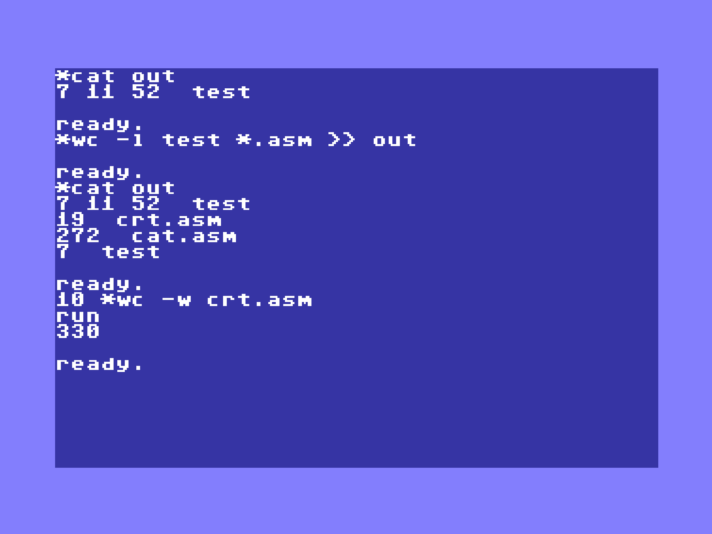

# BygShell
Shell like commands for the C64

Code and bugs by papapower@babygang, tests / ideas & support joy@babygang
2023-2025

work in progress, you've been warned !

## WTF is that again ?


Here you go, a new shell extension for the C64 by the Babygang, as if 2025 wasn't already too bad...
Well, well, after spending (too) many hours on the 1st version I still wasn't happy with the result and
starting to find it way too big and complicated, so I got back to the drawing board in order to try to
capture the essence of what this should be, to name it :

- Give the ability to execute external (as "on disk") commands to the C64 invite
- Keep the footprint minimal, adding mostly only support (kind of "BIOS") functions
- Be able to run that on a standard $8000-$9FFF 8Kb cartridge
- Have it run as much as possible along the JaffyDOS kernal extension extending JiffDOS for SD2IEC 
(because SD2IEC rules big time, whatever you may think of it), so avoid re-writing wedge commands etc... while
being able to run with a fastloader
- Keep a minimum of internal commands / the ability to add some of those
- Play nicely along BASIC, and as much as possible avoid hitting the BASIC RAM space

## Shell commands

### Script and external commands execution

All commands (internal and external) start with *
When a command is not found in the internal commands list then a lookup is done on disk on the current device for the
time beeing, if the currrent device is not defined, tries on disk #8.

There are no more shell scripts as you can use the commands within BASIC programs baby !



All commands should load to $C000 and start with :

- Their start address
- The command name as a pstring (if the command is the same than the previous one then it's not re-loaded)

Only a check to see if we loaded something after $C000 is done before trying to run the command.
The command should end with either a CLC if OK or SEC if KO and a RTS.

All external commands can :

- Process multiple files
- Process files from a directory wildcard expression
- Have a combination of single letters options, starting with "-"
- Pipe and pipe append results to an output SEQ file with ">" and ">>"

## Internal commands

- HELP
- M

## Data structures and provided "framework"

Note : this is beeing reviewed as a lot has moved, not all functions are available in the BIOS,
new ones are there, and the 16 bit registers have been moved around in the ZP space in order to
avoid conflicting with BASIC which uses a lot of those.

### 16 bit registers
```
8 x 16bit registers (R0 to R7) are stored on ZP starting at address $39
They are referenced with the following pre-defined labels :
zr0 to zr1 : base address of registers
zr0l to zr1l : lower bytes of registers
zr0h to zr1h : higher bytes of registers
```
### macro instructions with pre-processor for 16 bit registers

pre-processor is done through the pkick.py Python script, 

**MOV / MOVI**
```
mov r<n>, r<m>      : register n = register m
mov r<n>, #<m>      : register n = word m
mov r<n>, <addr>    : register n = content at address
mov a, (r<n>)       : a = byte at register n address
mov a, (r<n>++)     : a = byte at register n address, increment register
mov (r<n>), a       : store a at register n address
mov (r<n>++),a      : store a at register n address, increment register
mov (r<n>), r<m>    : store register m at address in register n
movi (r<n>), r<m>   : store r<m> at address stored at location r<n>
mov r<n>, (r<m>)    : store value at address in register m
mov <addr>, <addr2> : copy word at addr2 to addr
mov <addr>, #<val>  : copy value to addr
mov <addr>, r<n>    : store r<n> at address <addr>
mov r<n>, a         : register n = a
```

Warning : indirect MOV operations rely on Y beeing set to 0, if not then Y will be added to address

**ADD**
```
add r<n>, #<imm>    : add 8bit or 16bit immediate value to register n
add r<n>, a         : add a to register n
add <addr>, a       : add a to value at address <addr>
add <addr>, #<imm>  : add 8bit or 16bit immediate to value at address <addr>
add <addr>, <addr2> : add value at <addr2> to value at <addr> 
```
**INC, DEC**
```
inc r<n> : increment register
dec r<n> : decrement register
incw <addr>, inw <addr> : increment value at address <addr>
decw <addr>, dew <addr> : decrement value at address <addr>
```
**SWAP**
```
swap r<n>, r<m> : swap registers
```
**STC / LDC**
```
stc <address> : store carry as 1 or 0 to <address>
ldc <address> : get carry from 1 or 0 at <address>
```
**JNE / JEQ / JCC / JCS**
```
long branches, Bill style, missing some variants
```
**SWI**
```
swi <bios_function>                    : calls bios function
swi <bios_function>, <addr> [,<addr2>] : calls bios function with r0 = addr, r1 = addr2
```
***SWP**
```
swp : swap nybles of A
```
***SXY**
```
sxy : swap X and Y
```

### pStrings

Pstrings are Pascal like strings consisting of a length byte followed by max 255 characters

related macro :

**pstring("STRING VALUE")**

Initializes a pstring value with length preset according to the "STRING VALUE" length
    
### Lists

A list data structure contains multiple pStrings

### system variables

A pool of <name> / <pstring value> variables is maintained.
Some variables are pre-allocated

**var_set** : 
    Variable with name in R0 = pstring R1

**var_get** : 
```
    R1 = value of variable with name in R0 
    On exit : C=1 variable found, C=0 variable not found
```
**var_del** :
```
    Delete variable #X
```

### Helper BIOS functions

**is_digit**
```
C=1 if A is a digit
```
**set_bit**
```
Y = bit to set in A
```

### List of BIOS entry points

## System

**reset**
```
    Restart the shell, cold start
```
**file_load**
```
    Load a binary file for running, checks the presence of a BASIC stubs with a SYS instruction and starts code at $080D (2061)
```
**error**
```
    Print the error message in R0
```
## Screen & Keyboard I/O

**pprint**
```
    Print a pString, after expansion of contents
```
**pprintnl**
```
    Same as pprint, with a new line added
```
**print_int**
```
    X = print format
    R0 = value to print
    Format : %PL123456
        bit 6 = suppress heading spaces
        bit 7 = pad with spaces (default is '0')
```
**input**
```
    Accept input from the user, return results in input_buffer,
    On input : 
        C=1 : editor mode, cursor up / down not bringing history values,
              and X contains maximum length for line 
    On exit : R0 = input_buffer

    Typing is in insert mode
    Up and Down = history browsing
    Ctrl+K      = delete to end of line
    Ctrl+O or E = go to end of line
    Ctrl+U or A = go to start of line
    Run/stop    = break input, start new input
    Backspace / Insert works as usual
```
**pprinthex**

**pprinthex8**

**pprint_path**
```
    Prints the elements of a ppath object
    R0 = ppath element
```


## Conversions

**hex2int**

(**int2str** to add to BIOS)

(**str2int** to add to BIOS)

## Variables

**var_set**
```
    Variable with name in R0 = pstring R1
```
**var_get**
```
    R1 = value of variable with name in R0 
    On exit : C=1 variable found, C=0 variable not found
```
**var_del**
```
    Delete variable #X
```
**var_count**
```
    Count number of available variables or internal commands.
    R0 = source variables space
    On exit : A = number of variables

    shell.var_names = variables space
    shell.internal_commands = internal commands space
```

## Lists

**list_add**
```
    Add pstring to list
    R0 = list object
    R1 = pstring to add to list
    On exit : A = new item number
```
**list_get**
```
    Returns the Xths value in the list
    R0 = list object
    X = element number to retrieve
    On exit : C=1 and R0=value if OK, C=0 otherwhise
```
**list_del**
```
    Removes one entry from list
    R0 = list object
    X = object # to remove
    On exit : R0 = list object pointer
```
**list_print**

**list_size**
```
    Returns size of list
    R0 = list object
    On exit : A = number of elements in list
```
**list_reset**

## Parameters

**parameters_loop**
```
    call subroutine for all filenames in parameters
    r0 = subroutine address
    r1 = address of parameters list
```
## Disk I/O

**set_device**
```
    Selects the current device according to the value in variable "device"
```
**prep_path**
```
    Builds a ppath object from a pstring
    R0 = pstring input
    R1 = ppath output

    Path format :
    [device[,partition]]:][path/][file]

    ppath object format :
        Type : bitmat for presence of path components
            WITH_DEVICE=1
            WITH_PARTITION=2
            WITH_PATH=4
            WITH_NAME=8
        Device #
        Partition #
        path pstring
        name pstring
```
**build_path**
```
    Build a path pString from a ppath
    R1 = ppath source
    R0 = address of target pString
    C=0 adds : to filename, C=1 : no separator added
    On exit: r0 contains path:name
    on exit : X = 1st available device, A = number of devices
              R0 = devices table
    Device table is a 32 bytes of device types, 1 position for each
    device number and 1 byte to indicate presence / type of device
    Device types :
        00 - No serial device available
        01 - foreign drive (MSD, Excelerator, Lt.Kernal, etc.)
        41 - 1541 drive
        71 - 1571 drive
        81 - 1581 drive
        e0 - FD drive
        c0 - HD drive
        f0 - RD drive
        80 - RAMLink
        si %11xxxxxx : other with CMD capabilities
```
**lsblk**
```
    Probes and populates attached disk devices into the devices table
    C=1 for silent mode
```
**get_device_status**
```
    Get current device status
    C=1 prints result on screen, C=0 silent mode
    On exit : status code into R0, 2 positions
    C=0 if code 00, C=1 otherwise
```
**set_device_from_path**
```
    Changes the current device according to device in ppath object
    R0 = ppath object
    if the device change fails, falls back to previous current device
    value
```
## pStrings

**str_cat**
```
    pstring(r0) += pstring(r1)
```
**str_cpy**
```
    pstring(r1) = pstring(r0)
    return A = total copied bytes (R0 pstring length + 1)
```
**str_empty**
```
    Input R0 = pstring
    C(arry)=0 if string is empty (zero length or spaces)
    C=1 if string is not empty
```
**str_expand**
```
    pstring(r1) = expansed pstring(r0)
    expanses pstring(r0) according to the following modifiers :

        %% = %
        %R<n> = hex value of register R<n>
        %P<n> = pstring value at address of register R<n>
        %V<variable>% = pstring value stored for system variable with name <variable>
                        when a script is called, variables 0 up to 9 are populated with
                        script name and parameters
        %C<hexcolor> = insert character to change color to <hexcolor> (hex nibble)
                       R = reverse, N = normal, H = clear screen / home
        %H<hex> = insert character <hex>

    On exit : C=1 if error, C=0 if OK
```
**str_pat**
```
    Pattern filter apply r1 on r0
    Patterns can be ? or *
    On exit : C = 1 if filter matches
```
**str_cmp**
```
    Compare pstring(r0) and pstring(r1)
    On exit : C=1 if equals, C=0 otherwise
```
**str_chr**
```
    Find position of character X in pstring(r0)
    On exit : C=1 if found, Y = position
```
**str_rchr**
```
    Backwards str_chr
    On exit : C=1 if found, Y = position
```
**str_lstrip**
```
    Suppress spaces on left side of pstring(r0)
```
**str_len**
```
    Return length of pstring(r0) into A
    On exit : A = pstring length
```
**str_del**
```
    Remove Y characters of pstring r0, starting at X
```
**str_ins**
```
    Insert pstring(r1) at position X of pstring(r0)
    pstring(r0) string size should be big enough
```
**str_ncpy**
```
    pstring(r1) = left(pstring(r0), X)
```
**str_split**
```
    Split pstring(r0) with separator X
    On exit : C = 1 if split occurs, 
              A = number of items after split
```

## File

**file_open**
```
    R0 = filename to open, X = channel to use.
    C=0 open for reading, C=1 open for writing (applies a CHKIN / CHKOUT to channel)
    On exit : C=1 if open failed

    Open disk file for reading / writing.
    Secondary address will be X too, except for directory where it's forced to 0.
    For writing the filename should contain the file type and write indicator.
```
**file_close**
```
    X = channel to close
```
**file_readline**
```
    Reads line from current opened input channel into workbuffer
    C=1 : end of file
    A = length read
```
**buffer_read**
```
    X = channel to read from, R0 = pString buffer, C=0 for normal reading or C=1 for line reading.
    The pString buffer should be allocated, the function will read at most the length indicated in the pString.
    Line reading stops when a $0A or $0D character is found.
    On exit C=1 if end of file or error

        ldx #2
        lda #8
        sta buffer_hexdump
        clc
        swi buffer_read, buffer_hexdump
```
**buffer_write**
```
    X = channel to write to, R0 = pstring buffer to write to channel
    (no error check for the time beeing on the write action)
```

## Directory

**directory_open**
```
    Open the directory

    Works on current device, resets the directory filters
    On exit : C=1 if error
```
**directory_set_filter**
```
    Filters directory entries

    R0 = pstring of filename filter
    X = bitmap of filetypes filter

    File types are in bios.directory namespace :

    bios.directory.TYPE_PRG     PRG program files
    bios.directory.TYPE_SEQ     SEQ files
    bios.directory.TYPE_USR     USR files
    bios.directory.TYPE_REL     REL files
    bios.directory.TYPE_DIR     DIR directory
    bios.directory.TYPE_ERR     ERR file in error status
    bios.directory.TYPE_FILES   PRG / USR / SEQ files

    Example :

        swi directory_open
        ldx #bios.directory.TYPE_PRG
        swi directory_set_filter, filtre_dir
        ...
    filtre_dir:
        pstring("*.TXT")
```
**directory_get_entry**
```
    Retrieves next directory entry

    Populates the bios.directory.entry data structure

    On exit :
        A   : entry type
            $00 = disk name
            $80 = filtered entry

        C=1 : end of directory

    Example :

        dir_next:
            swi directory_get_entry
            bcs dir_end
            beq dir_end
            bmi dir_next

            swi pprintnl, bios.directory.entry.filename
            jmp dir_next

        dir_end:
            swi directory_close
```
**directory_close**
```
    Close the directory
```
**directory.entry data structure**
```
    Available at bios.directory.entry

    entry:
        {
        // Filesize in blocks
        size:
            .word 0

        // Filename
        filename:
            pstring("0123456789ABCDEF")

        // Filetype string
        type:
            pstring("*DIR<")

        // Filetype binary value
        filetype:
            .byte 0
        }
```
**is_filter**
```
    Check if pString in R0 contains wildcards (* and ?)
    C=1 if wildcards were found
```

# External commands

**CAT**
```
*cat <file> [<file> ...]

print file(s) contents to screen
    options : 
    N = numbers all lines
    E = print $ at EOL
    B = numbers all non empty lines
    P = paginates output
    H = hexdump
    A = read C64 binary start address for hexdump
```

**WC**
```
*wc <file> [<file> ...]

count lines / words / bytes of files
    options :
    L = count lines
    W = count words
    C = count bytes
    Q = don't print filename
```

**SEARCH**
```
*search <pattern> <file> [<file> ...]

search for pattern in files
    options :
    N = print line number
    L = print only line number
    V = lines not matching
    C = count lines matching
```

**HEAD**
```
*head <file> [<file> ...]

print first lines of files
    options :
    N = change max lines number
```
**KOALA**
```
*koala <image>
    load and view Koala format image (.KLA file)
    options :
    K = wait for keypress
```
