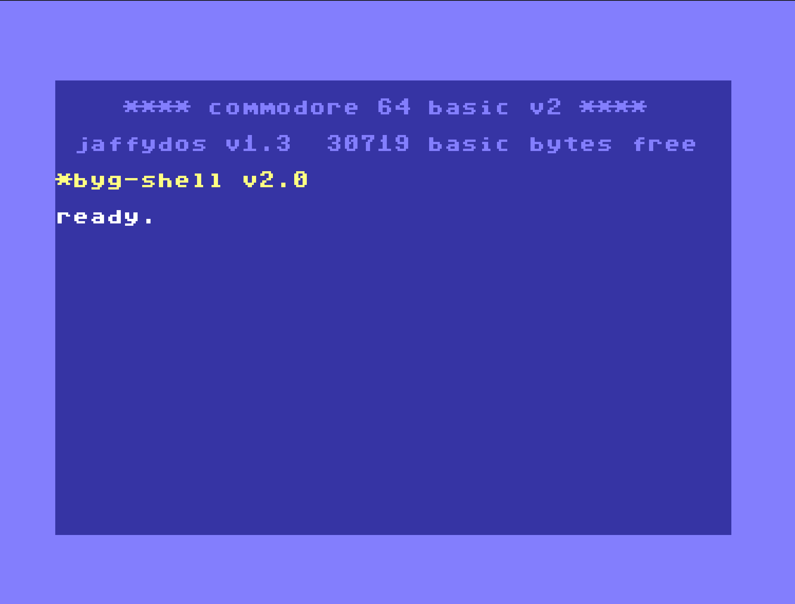
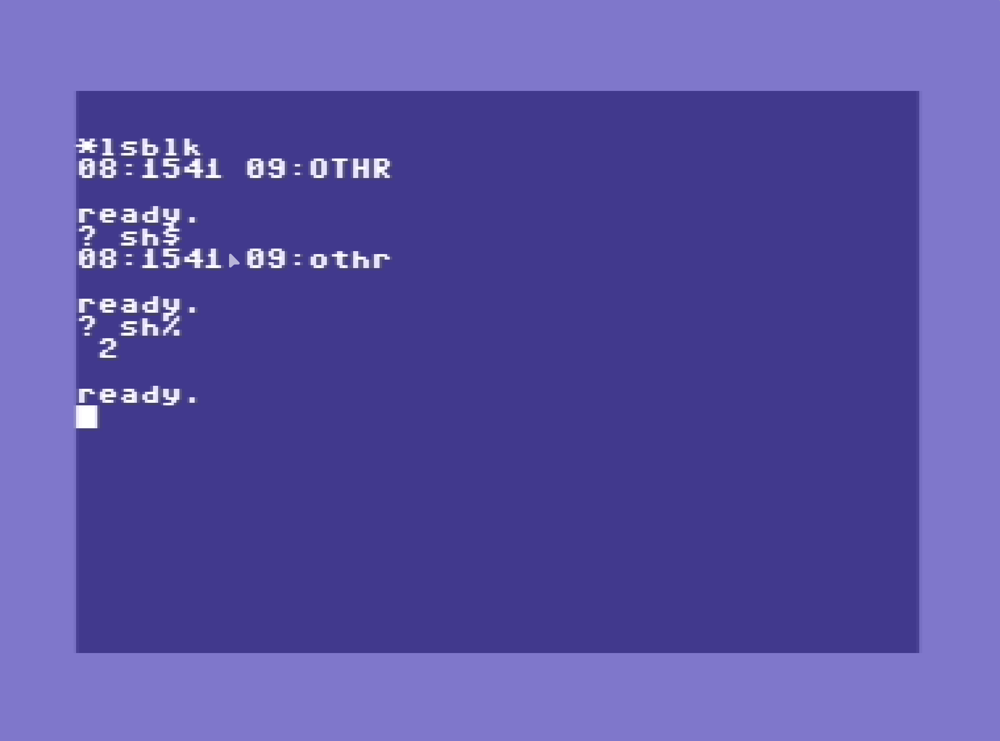
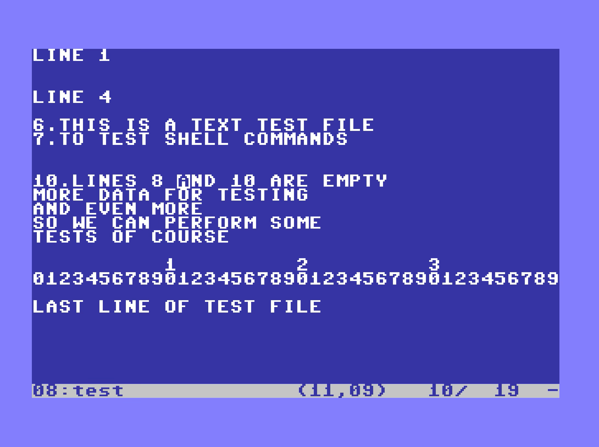

# BygShell
Shell like commands for the C64

Code and bugs by papapower@babygang, tests / ideas & support joy@babygang
2023-2025

work in progress, you've been warned !

## WTF is that again ?



Here you go, a new shell extension for the C64 by the Babygang, as if 2025 wasn't already too bad...
Well, well, after spending (too) many hours on the 1st version I still wasn't happy with the result and
starting to find it way too big and complicated, so I got back to the drawing board in order to try to
capture the essence of what this should be, to name it :

- Give the ability to execute external (as "on disk") commands to the C64 invite
- Keep the footprint minimal, adding mostly only support (kind of "BIOS") functions
- Be able to run that on a standard $8000-$9FFF 8Kb cartridge
- Have it run as much as possible along the JaffyDOS kernal extension extending JiffDOS for SD2IEC 
(because SD2IEC rules big time, whatever you may think of it), so avoid re-writing wedge commands etc... while
being able to run with a fastloader
- Keep a minimum of internal commands / the ability to add some of those
- Play nicely along BASIC, and as much as possible avoid hitting the BASIC RAM space

All of this has been developped using an iPad, you know, the "consume only device" :)

## What it's not ##

- A new OS : the objective is to complete existing C64 BASIC invite capabilities, not to build something new from the ground up (and there are some nice things available already for that : C64OS, GEOS, CP/M65...)
- A GUI/TUI : even if the BIOS functions provide some capabilities, it's not a GUI framework (don't expect mouse support too)
- A shell with file and directory commands : we're not going to bring cp / cd / rm / rmdir / mkdir... and any command that already exists in the JiffyDOS wedge (and space is precious)
- A shell loop with a prompt, that was the first attempt, and that was a wrong idea : BYG Shell needs to live alongside BASIC invite and DOS wedge, and to coexist with your C64 programs as much as possible (we call it "shell extension" for a reason)

## Shell commands

### Script and external commands execution

All commands (internal and external) start with * (hello BBC)
When a command is not found in the internal commands list then a lookup is done on disk on the current device or if configured with the ENV internal command lookup can be done on another device / directory location. If the currrent device is not defined and no device / directory is defined for binaries, lookup is performed on device #8.
A boot script lookup and run feature is on the todo list in order to be able to soft define binaries location for external commands.

There are no more shell scripts as you can use the commands within BASIC programs baby !


All commands should load to $C000 and start with :

- Their start address as a word
- The command name as a pstring (if the command is the same than the previous one then it's not re-loaded)

Only a check to see if we loaded something after $C000 is done before trying to run the command.
The command should end with either a CLC if OK or SEC if KO and a RTS.

All external commands can :

- Process multiple files if needed
- Process files from a directory wildcard expression using * character
- Use BASIC string variables as parameters
- Have a combination of single letters options, starting with "-"
- Have integer values associated to options with "-X=<value>" syntax
- Return integer and string results to BASIC SH% and SH$ variables
- Pipe and pipe append results to an output SEQ file with ">" and ">>"

## Internal commands

### Commands ###

- HELP : lists the internal commands and retrieves help for external commands with HELP <command_name>
- M : memory dump / write, takes one start address or start / end address and
when a single address is given you can write bytes just after it. Also view RAM under BASIC
- ENV : view some environment info, change device and path location of external commands
    -q = quiet mode
    -d <device> = define device for external commands lookup
    -p <device> = define path for external commands lookup
    
Apart from -q option, env options have to be fed one at a time, for example to set the path
to /bin on device 11 :

```
*env -dq 11
*env -pq //bin/
```


You can get a list of external commands and some info using "*help commands"
Help files are looked up on the same device / directory as external command files.
Help files name format is : <command_name>.hlp
Help files use line coloring according of special chars as first char of line :

```
# Title
: Main info
* Subtitle
- Sub content
= Notes
```


### Keys ###

CTRL-K is mapped as a master key for some internal shortcuts
The shortcuts are deactivated for the moment within the EDIT command
When you press CTRL-K the cursor changes color to green indicating that the
system is waiting for the end of the key sequence

Existing shortcuts :

```
CTRL-K-A   : go to the start of current logical screen line
CTRL-K-E   : go to the end of the current logical screen line
CTRL-K-C   : copy to clipboard from cursor position to start of logical line
CTRL-K-D   : copy whole current line to clipboard
CTRL-K-V   : paste from clipboard
CTRL-K-DEL : delete from cursor position to end of line
CTRL-K-HOME: delete all lines except current physical one
CTRL-K-^   : swap screens (up arrow)
```

You can view the current clipboard content using the ENV command

### Add ons ###

You can use hex values in basic using the $ prefix, for both byte and word values.

Ex: ? $e2+$fc*$0100

## External commands

The following commands are available : 

- cat, chars, hw, checksum, join, menu, diff, mon, touch, edit, koala, search, head, lsblk, wc

**CAT**

CAT prints the content of a single file or a list of files to screen
CAT can perform an hexdump of files, with or without starting addresses
Output is done asuming the input files are ASCII encoded when not in HEX mode
You can exit CAT in paginate mode with Q, X or run/stop


```
*cat <file> [<file> ...]

print file(s) contents to screen
    options : 
    N = numbers all lines
    E = print $ at EOL
    B = numbers all non empty lines
    P = paginates output
    H = hexdump
    A = read C64 binary start address for hexdump
```

**CHECKSUM**

CHECKSUM performs a CRC16 on files, returns last one in SH%

```
*checksum <file> [<file> ...] [-q]

Calculates a CRC16 on files
    options :
    Q = don't print output
```

**WC**

WC counts lines, words and bytes of files

```
*wc <file> [<file> ...]

count lines / words / bytes of files
    options :
    L = count lines
    W = count words
    C = count bytes
    Q = don't print filename
```

**LSBLK**

LSBLK identifies and lists connected disk devices,
it returns number of drives in SH% and devices list in SH$



```
*lsblk

Scan attached devices for disk drives
    options :
    Q = quiet mode
    H = help
    
```

**JOIN**

JOIN appends binary or text files to an output file.


```
*join

Append files to output
    options :
    A = append instead of create output file
    Q = quiet mode
    H = help
```

**SEARCH**

SEARCH performs pattern matching on files, and prints matching lines of files

```
*search <pattern> <file> [<file> ...]

search for pattern in files
    options :
    N = print line number
    L = print only line number
    V = lines not matching
    C = count lines matching
    
Note:
    patterns rely only on * character at the moment,
    you should also use * on start / end when needed
```

**SID**

SID loads PSID file, show info and play songs.
By default the first song is selected, you can change songs
including while playing with -p=<songID> and stop play IRQ
with -s
You can use redirection to capture SID info.


```
*sid <file> [options]

Play SID file or show info on file
    options :
    P = Play SID file, you can give song number
    S = Stop playing
    I = Show info on SID file
```

**TOUCH**

TOUCH creates empty files, by default the filetype is SEQ
You can bypass filetype using the P option or by adding ,P to you filenames
An error is thrown if a file already exists

```
*touch <file> [<file> ...]

create new empty file
    options :
    P = create PRG file instead of default SEQ
    S = size of fille to create (fill with # by default)
    B = byte value to use for filling
    T = create text compatible file (adds LF)    
```

**DIFF**

DIFF compares two files, and writes the differences
The total number of different lines found so far is returned in SH% to BASIC
You can run DIFF in quiet mode with the Q option


```
*diff <file1> <file2>]

compare files
    options :
    F = stop after first difference
    P = paginate output
    N = stop after N differences
    Q = quiet mode, only return value in SH%
```

**HEAD**

HEAD shows the first lines of files

```
*head <file> [<file> ...]

print first lines of files
    options :
    N = change max lines number
    Q = no filename
    V = always print filename
    P = paginate output
```

**CHARS**

CHARS displays a character set map by default
You can display a colour palette with the C option


```
*chars
    display the character map
    options :
    H = show help
    C = map of colors
```

**KOALA**

KOALA loads and display a koalapaint image and wait for a key press
The image is moved to the last VIC II bank for display

```
*koala <image>
    load and view Koala format image (.KLA file)
    options :
    K = wait for keypress
```

**EDIT**

EDIT is a small text editor allowing ASCII files editing
If launched with a non-existing filename, EDIT will use the filename provided and create
a new file when saving, if no name is provided, default filename is "tmp"
Default filetype for file creation is SEQ, you can force filetype to PRG with ,P suffix on
your filename
EDIT will replace existing files when saving
Memory management is limited at the moment, each update consumes memory



```
*edit [<file>]
    small text file editor, see edit.hlp
    default filename for new files is tmp

    -- File management --

    run/stop : quit without saving
    ctrl-x : quit and save
    ctrl-s : save file
    
    -- Editor --
    
    ctrl-a   : start of line
    ctrl-e   : end of line
    ctrl-w   : next word
    ctrl-k t : top of document
    ctrl-k e : end of document
    ctrl-k + : set mark
    ctrl-k - : goto mark
```

**MENU**

MENU allows the user to choice between different items presented in a non destructive list on screen
The list can be displayed on the right (default) or left top side of screen
The items come from the MENU parameters including files from current directory when pattern matching 
character is used (ex: MENU *.koa)
When run/stop or q/x are pressed, sh%=0, sh$= non affected
You can surround items containing spaces with double quotes. When using quoted values an expansion of
the string is done using the % character, as follows : 

- %% => %
- %' => "
- %$ => value of BASIC SH$ variable

Expansion still contains bugs


```
*menu <item>...
    menu popup, chosen item number in sh% and item content in sh$
    you can mix directory patterns in the items list
    when run/stop or q/x are pressed, sh%=0, sh$= non affected
    
    options:
    L = menu on left side (right side by default)
```

**XFORM**

xForm processes delimited files line by line, using a small set of commands applied to each line.
(config file not implemented yet)

Commands available:

- SEP <num> or <char> : define separator to split each line
- SEL a,b,c... or * : select columns (or all with *) for processing / output
- WRITE : write selected columns with separator and new line
- WRITEC : same as write but without new line
- NL : write new line
- ECHO <val> : write <val>
- UPPER : converts selected columns to uppercase
- LOWER : converts selected columns to lowercase
- HEAD <n> : process only <n> lines
- SKIP <n> : skip first <n> lines of file
- LINEID : write line number
- FILTER <col> <content> : filter, keep lines where content is in column

```
*xform <file> <command>...| -f <config>
    xform performs commands listed on each line of the input file

    options:
    F = take commands from config file
```

**CONV**

Conv command provides file format conversion.
Conversions are currently limited to what is available in the BIOS.


```
*conv <file>... -<input format> -<output format> [> <output file>]
    conv converts file formats

    options:
    A = ASCII
    P = PETSCII
    S = Screen codes
    U = Upper
    L = Lower

Example:

*conv test.txt -a -p > test_petscii
*conv test2.txt -a -u
```

## Data structures and provided "framework"

Note : this is beeing reviewed as a lot has moved, not all functions are available in the BIOS,
new ones are there, and the 16 bit registers have been moved around in the ZP space in order to
avoid conflicting with BASIC which uses a lot of those.

### 16 bit registers
```
8 x 16bit registers (R0 to R7) are stored on ZP, see macros.asm for locations
They are referenced with the following pre-defined labels :
zr0 to zr7 : base address of registers
zr0l to zr7l : lower bytes of registers
zr0h to zr7h : higher bytes of registers
```
### macro instructions with pre-processor for 16 bit registers

pre-processor is done through the pkick.py Python script, 

**MOV, MOVI**
```
mov r<n>, r<m>      : register n = register m
mov r<n>, #<m>      : register n = word m
mov r<n>, <addr>    : register n = content at address
mov r<n>, a         : register n = value of A, high byte set to 0
mov a, (r<n>)       : a = byte at register n address
mov a, (r<n>++)     : a = byte at register n address, increment register
mov (r<n>), a       : store a at register n address
mov (r<n>++),a      : store a at register n address, increment register
mov (r<n>), r<m>    : store register m at address in register n
mov r<n>, (r<m>)    : store value at address in register m
mov <addr>, <addr2> : copy word at addr2 to addr
mov <addr>, #<val>  : copy value to addr
mov <addr>, r<n>    : store r<n> at address <addr>

movi (r<n>), r<m>   : store r<m> at address stored at location of value of r<n>
```

Warning : MOV (m),n operations rely on Y beeing set to 0, if not then Y will be added to address

**ADD, SUB**
```
add r<n>, #<imm>    : add 8bit or 16bit immediate value to register n
add r<n>, a         : add a to register n
add r<n>, r<m>      : add register m to register n
add <addr>, a       : add a to value at address <addr>
add <addr>, #<imm>  : add 8bit or 16bit immediate to value at address <addr>
add <addr>, <addr2> : add value at <addr2> to value at <addr> 

sub r<n>, #<imm>    : substract 8bit or 16bit immediate value from register n
sub r<n>, a         : substract a from register n, preserves A
sub r<n>, r<m>      : substract register m from register n
sub <addr>, a       : substract a from value at address <addr>
sub <addr>, #<imm>  : substract 8bit or 16bit immediate from value at address <addr>
sub <addr>, <addr2> : substract value at <addr2> from value at <addr> 
```
**INC, DEC, INCW, DECW**
```
inc r<n> : increment register
dec r<n> : decrement register
incw <addr> : increment value at address <addr>
decw <addr> : decrement value at address <addr>
```
**CMPW, BGE, BLE, BLT, BGT**
```
cmpw r<n>,r<m> : compare registers
cmpw #<val>,r<m> or cmpw r<n>,#<val> : compare registers / values
cmpw <addr>,r<m> or cmpw r<n>, #<val> : compare registers / values
bge <item1>,<item2>,<label> : branch to <label> if <item1> >= <item2>
bgt <item1>,<item2>,<label> : branch to <label> if <item1> > <item2>
ble <item1>,<item2>,<label> : branch to <label> if <item1> <= <item2>
blt <item1>,<item2>,<label> : branch to <label> if <item1> < <item2>
```
**PUSH, POP**
```
push r<n> : push register on stack
pop r<n>  : pop register from stack
```

**SWAP**
```
swap r<n>, r<m> : swap registers
swap <addr1>, <addr2> : swap 16 bits values at addresses <addr1> and <addr2>
```
***SWP**
```
swp : swap nybles of A
```
***SXY**
```
sxy : swap X and Y
```
**STC, LDC**
```
stc <address> : store carry as 1 or 0 to <address>
ldc <address> : get carry from 1 or 0 at <address>
```
**JNE, JEQ, JCC, JCS**
```
long branches, Bill style, missing some variants
```
**SWI**
```
swi <bios_function>                    : calls bios function
swi <bios_function>, <addr> [,<addr2>] : calls bios function with r0 = addr, r1 = addr2
```

### pStrings

Pstrings are Pascal like strings consisting of a length byte followed by max 255 characters

The following macro is provided in macros.asm in order to insert pstring values into you code :

**pstring("String Value")**

Initializes a pstring value with length preset according to the "String Value" length

Note that pStrings don't contain a zero at the end

### Lists

A list data structure contains multiple pStrings

### system variables

On this version we rely on access to BASIC variables.
A couple of return values can be set from the commands :

- SH% : integer return value
- SH$ : string returnn value

### Helper BIOS functions

**is_digit**
```
C=1 if A is a digit
```
**set_bit**
```
Y = bit to set in A
```

### List of BIOS entry points

## System

**reset**
```
    Restart the shell, cold start
```
**file_load**
```
    Load a binary file into memory
```
**error**
```
    Print the error message in R0
```
## Screen & Keyboard I/O

**pprint**
```
    Print a pString, after expansion of contents
```
**pprint_nl**
```
    Same as pprint, with a new line added
```
**pprint_lines**
```
    Prints a contiguous list of pStrings in memory, ending with 0
    Each individual line is printed with a new line added
```
**print_int**
```
    X = print format
    R0 = value to print
    Format : %PL123456
        bit 6 = suppress heading spaces
        bit 7 = pad with spaces (default is '0')
```

**pprinthex**

**pprinthex8**

**pprint_path**
```
    Prints the elements of a ppath object
    R0 = ppath element
```


## Conversions

**hex2int**

(**int2str** to add to BIOS)

(**str2int** to add to BIOS)

## Variables

**get_basic_string**
```
    Get a basic string value
```
**set_basic_string**
```
    Set a basic string content, creates the variable if needed
```
**return_int**
```
    Returns integer value into SH%
```

## Nodes

Node structure is a list of word pointers to data.
1st word of structure is the total number of nodes, followed
by the node values.

**node_insert**
```
    Insert blank node at position R0 in node structure R1
```
**node_delete**
```
    Delete node at position R0 in node structure R1
```
**node_append/push**
```
    Add node value in R0 to the end of node structure R1
```
**node_remove/pop**
```
    Get into R0 and remove value at end of node structure R1
```

## Parameters

**param_init**
```
```
**param_process**
```
```

## Disk I/O

**get_device_status**
```
```

## pStrings

**str_cat**
```
    pstring(r0) += pstring(r1)
```
**str_cpy**
```
    pstring(r1) = pstring(r0)
    return A = total copied bytes (R0 pstring length + 1)
```
**str_empty**
```
    Input R0 = pstring
    C(arry)=0 if string is empty (zero length or spaces)
    C=1 if string is not empty
```
**str_expand**
```
    pstring(r1) = expansed pstring(r0)
    expanses pstring(r0) according to the following modifiers :

        %% = %
        %R<n> = hex value of register R<n>
        %P<n> = pstring value at address of register R<n>
        %V<variable>% = pstring value stored for system variable with name <variable>
                        when a script is called, variables 0 up to 9 are populated with
                        script name and parameters
        %C<hexcolor> = insert character to change color to <hexcolor> (hex nibble)
                       R = reverse, N = normal, H = clear screen / home
        %H<hex> = insert character <hex>

    On exit : C=1 if error, C=0 if OK
```
**str_pat**
```
    Pattern filter apply r1 on r0
    Patterns can be ? or *
    On exit : C = 1 if filter matches
```
**str_str**
```
    Substring search : lookup for pstring(r1) in pstring(r0)
    On exit : C=1 if equals, C=0 otherwise
```
**str_cmp**
```
    Compare pstring(r0) and pstring(r1)
    On exit : C=1 if equals, C=0 otherwise
```
**str_chr**
```
    Find position of character X in pstring(r0)
    On exit : C=1 if found, Y = position
```
**str_rchr**
```
    Backwards str_chr
    On exit : C=1 if found, Y = position
```
**str_lstrip**
```
    Suppress spaces on left side of pstring(r0)
```
**str_len**
```
    Return length of pstring(r0) into A
    On exit : A = pstring length
```
**str_del**
```
    Remove Y characters of pstring r0, starting at X
```
**str_ins**
```
    Insert pstring(r1) at position X of pstring(r0)
    pstring(r0) string size should be big enough
```
**str_ncpy**
```
    pstring(r1) = left(pstring(r0), X)
```
**str_split**
```
    Split pstring(r0) with separator X
    On exit : C = 1 if split occurs, 
              A = number of items after split
```
**str_next**
```
    r0 = pstring after r0, when there is a contiguous list
```
**str_pad**
```
    Pad or cut pstring(r0) to length X
```

## lines

**lines_goto**
```
```
**lines_find**
```
```

## File

**file_open**
```
    R0 = filename to open, X = channel to use.
    C=0 open for reading, C=1 open for writing (applies a CHKIN / CHKOUT to channel)
    On exit : C=1 if open failed

    Open disk file for reading / writing.
    Secondary address will be X too, except for directory where it's forced to 0.
    For writing the filename should contain the file type and write indicator.
```
**file_close**
```
    X = channel to close
```
**file_readline**
```
    Reads line from current opened input channel into workbuffer
    C=1 : end of file
    A = length read
```
**buffer_read**
```
    X = channel to read from, R0 = pString buffer, C=0 for normal reading or C=1 for line reading.
    The pString buffer should be allocated, the function will read at most the length indicated in the pString.
    Line reading stops when a $0A or $0D character is found.
    On exit C=1 if end of file or error

        ldx #2
        lda #8
        sta buffer_hexdump
        clc
        swi buffer_read, buffer_hexdump
```
**buffer_write**
```
    X = channel to write to, R0 = pstring buffer to write to channel
    (no error check for the time beeing on the write action)
```

## Directory

Warning : deprecated section, hasn't been fully moved from old version yet

**directory_open**
```
    Open the directory

    Works on current device, resets the directory filters
    On exit : C=1 if error
```
**directory_set_filter**
```
    Filters directory entries

    R0 = pstring of filename filter
    X = bitmap of filetypes filter

    File types are in bios.directory namespace :

    bios.directory.TYPE_PRG     PRG program files
    bios.directory.TYPE_SEQ     SEQ files
    bios.directory.TYPE_USR     USR files
    bios.directory.TYPE_REL     REL files
    bios.directory.TYPE_DIR     DIR directory
    bios.directory.TYPE_ERR     ERR file in error status
    bios.directory.TYPE_FILES   PRG / USR / SEQ files

    Example :

        swi directory_open
        ldx #bios.directory.TYPE_PRG
        swi directory_set_filter, filtre_dir
        ...
    filtre_dir:
        pstring("*.TXT")
```
**directory_get_entry**
```
    Retrieves next directory entry

    Populates the bios.directory.entry data structure

    On exit :
        A   : entry type
            $00 = disk name
            $80 = filtered entry

        C=1 : end of directory

    Example :

        dir_next:
            swi directory_get_entry
            bcs dir_end
            beq dir_end
            bmi dir_next

            swi pprintnl, bios.directory.entry.filename
            jmp dir_next

        dir_end:
            swi directory_close
```
**directory_close**
```
    Close the directory
```
**directory.entry data structure**
```
    Available at bios.directory.entry

    entry:
        {
        // Filesize in blocks
        size:
            .word 0

        // Filename
        filename:
            pstring("0123456789ABCDEF")

        // Filetype string
        type:
            pstring("*DIR<")

        // Filetype binary value
        filetype:
            .byte 0
        }
```
**is_filter**
```
    Check if pString in R0 contains wildcards for parameter expansion (* and $)
    C=1 if wildcards were found
```

